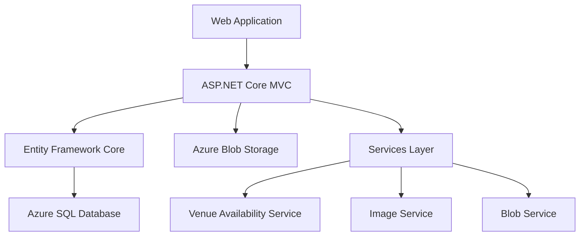
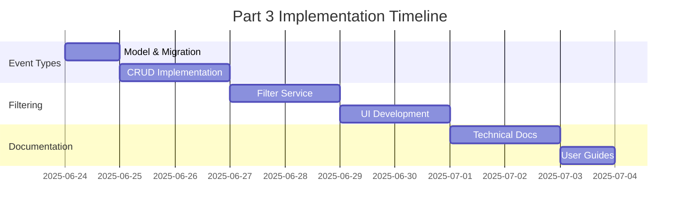

# Part 3 - EventEase Progress Report

## Current Status Overview

### Part 1 & 2 Achievements ✅

- **Database Core Implementation**
  - Venue, Event, Booking, and Client tables ✓
  - Proper relationships and constraints ✓
  - Entity Framework Core integration ✓

- **Azure Integration**
  - Azure SQL Database deployment ✓
  - Blob Storage for image management ✓
  - Web App Service deployment ✓

- **Core Features**
  - CRUD operations for all entities ✓
  - Image upload and management ✓
  - Booking validation system ✓
  - Double booking prevention ✓
  - Basic error handling ✓

### Current Architecture



## Part 3 Implementation Plan

### 1. Event Type System 🎯 (Completed)

Implementation Details:
1. Created `EventType` entity with following properties:
   - EventTypeId (Primary Key)
   - Name (Required, max length 100)
   - Description (max length 500)
   - IsActive (boolean)

2. Database Integration:
   - Added one-to-many relationship with Event entity
   - Created migration with seed data for common event types
   - Added foreign key constraint to prevent orphaned events

3. User Interface:
   - Created CRUD operations for event types
   - Added event type selection to event creation/editing
   - Updated event listings to display event types
   - Added validation to prevent deletion of in-use event types

4. Features:
   - Active/Inactive status for event types
   - Default event types seeded in database
   - Event type management restricted to admin users
   - Validation to ensure events have valid event types

#### New Models
- `EventType` entity
  ```csharp
  public class EventType
  {
      public int EventTypeId { get; set; }
      public string Name { get; set; }
      public string Description { get; set; }
      public bool IsActive { get; set; }
  }
  ```

#### Database Updates
- Add EventType table
- Add EventTypeId to Event table
- Add Availability field to Venue table

### 2. Advanced Filtering System 🔍

#### Components to Implement
1. **Filter Service**
   - Date range filtering
   - Event type filtering
   - Venue availability filtering
   - Combined search capabilities

2. **UI Components**
   - Filter form with multiple criteria
   - Dynamic results updating
   - Clear filter options

### 3. Search Enhancement 🔎

#### Features to Add
- Full-text search across venues and events
- Typeahead suggestions
- Search result highlighting
- Search analytics logging

### 4. Documentation & Security 📚

#### Documentation Tasks
1. System Architecture Documentation
   - Component diagrams
   - Data flow diagrams
   - Azure service integration details

2. Technical Documentation
   - API documentation
   - Database schema documentation
   - Deployment procedures

3. User Documentation
   - System usage guides
   - Booking process documentation
   - Error handling procedures

#### Security Enhancements
- Role-based access control
- Audit logging
- Input validation improvements
- Security headers implementation

## Implementation Timeline



## Risk Assessment

### Technical Risks
1. **Data Migration**
   - Risk: Existing event data needs mapping to new event types
   - Mitigation: Create migration script with default event type

2. **Performance**
   - Risk: Complex filtering could impact query performance
   - Mitigation: Implement caching and query optimization

### Project Risks
1. **Timeline**
   - Risk: Complex filtering implementation could exceed timeline
   - Mitigation: Prioritize core features, phase additional features

2. **Integration**
   - Risk: New features could affect existing functionality
   - Mitigation: Comprehensive testing plan and staging deployment

## Next Steps

1. Create EventType migration and model
2. Implement EventType CRUD operations
3. Develop filter service
4. Update UI for new filtering capabilities
5. Document new features and architecture
6. Deploy and validate changes

## Success Criteria

- [ ] All EventType operations functional
- [ ] Advanced filtering working across all criteria
- [ ] Documentation complete and accurate
- [ ] Performance metrics within acceptable ranges
- [ ] All existing functionality preserved
- [ ] Security measures implemented and tested
